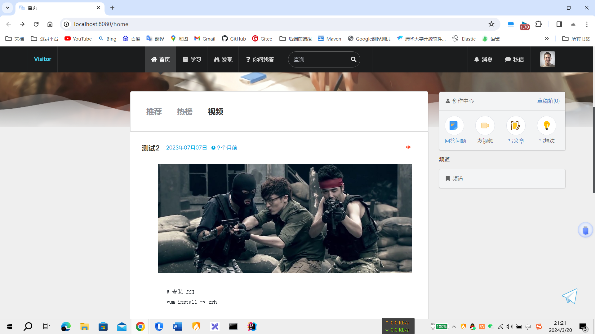
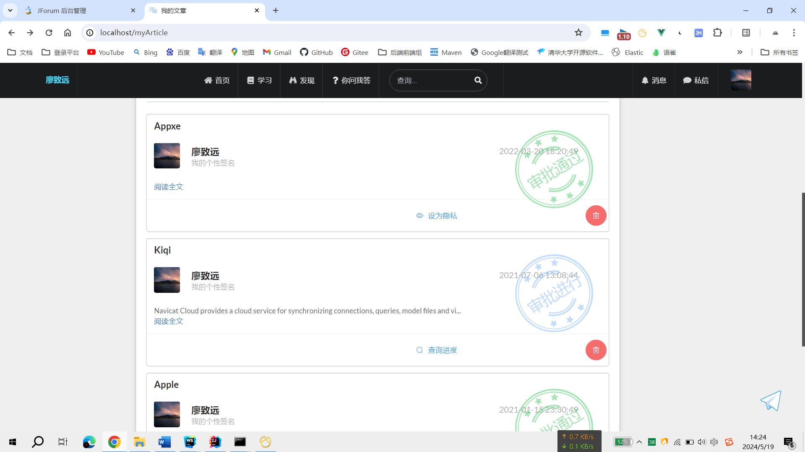
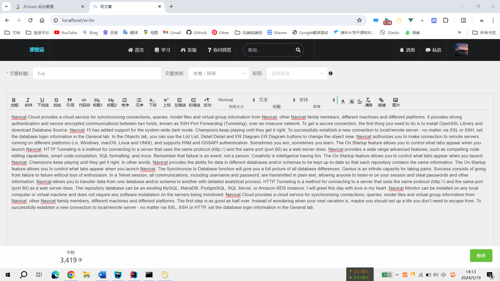
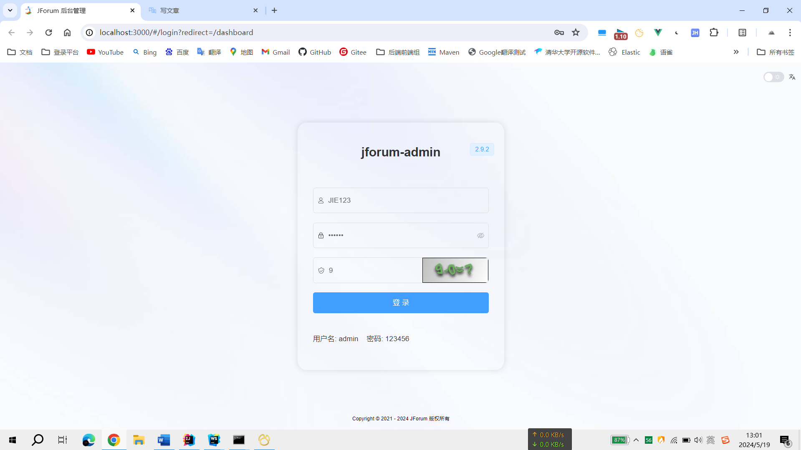
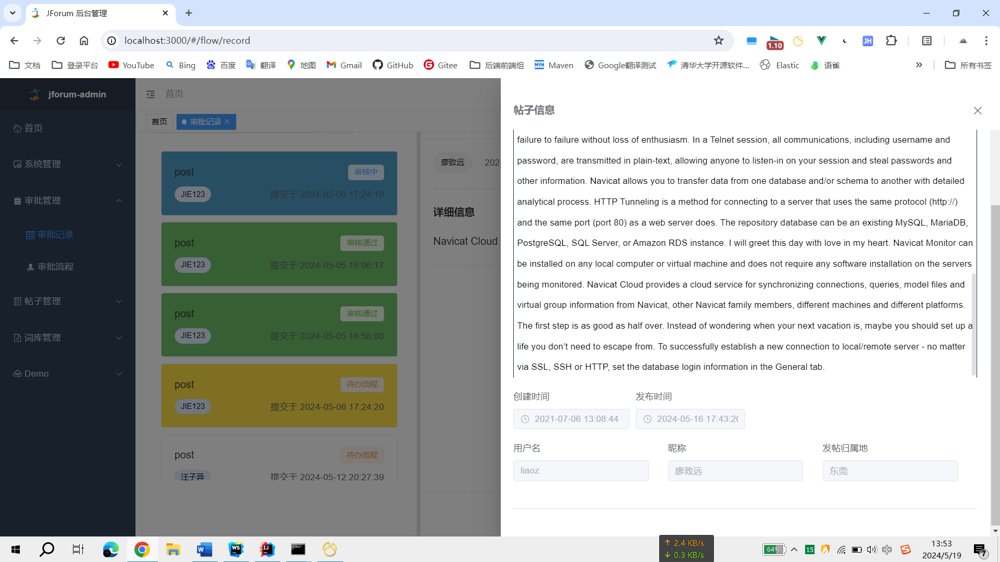

# JForum-Master 开发

项目所用到的框架
> 若依Ruoyi: https://gitee.com/y_project/RuoYi-Vue
>
> 有来来源组织: https://gitee.com/youlaiorg/vue3-element-admin?_from=gitee_search
>
> Camunda学习 参考 snail-camunda: https://gitee.com/wanglonewalker/snail-camunda
>

# 前台部分界面

## 1.登录界面

## 2.首页

## 3.个人主页[帖子审核]

## 4.帖子修改

# 后台部分页面

## 1.后台登录界面

## 2.帖子审核
